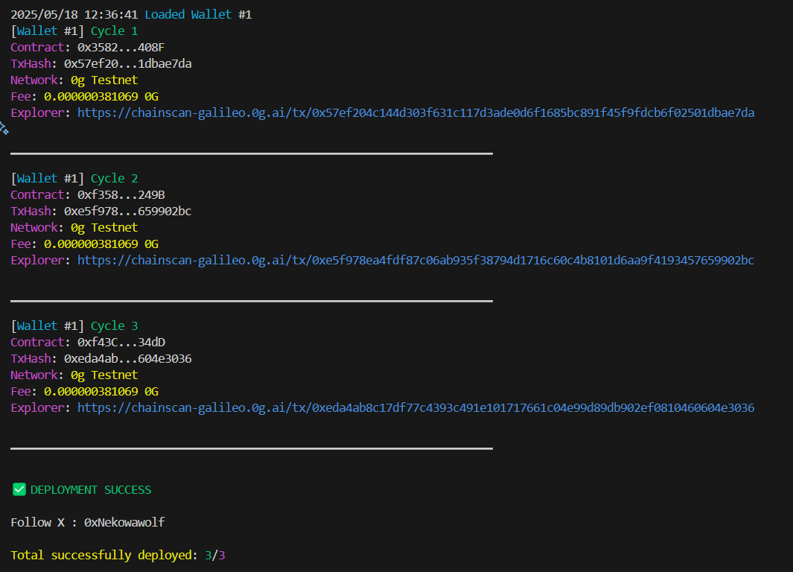

# Contract deployer bot

Contract deployer bot is an automated tool that simplifies the process of deploying smart contracts with ease. In just a few clicks, you can deploy to the blockchain



## 🚀 Features

- Multi-Chain Deployment
- Deployments using multiple wallets
- Automatic gas price calculation for optimal deployment costs
- Clear success/failure reports with explorer links
- Supports up to 10 wallets for distributed deployments
- Immediate failure detection with detailed error reporting
- Interactive menu for choosing deployment network

## 🌐 Chain Support

- Monad
- MegaETH
- Rise
- 0G
- More soon

## 📌 Setup

Follow these steps to set up and run the bot.

### 1️⃣ Clone the Repository

```bash
git clone https://github.com/nekowawolf/contract-deployer-bot.git
cd contract-deployer-bot
```

### 2️⃣ Install Dependencies

```bash
go mod tidy
```

### 4️⃣ Create .env

Create a `.env` file in the project directory with the following structure:

```bash
PRIVATE_KEYS_WALLET1=
PRIVATE_KEYS_WALLET2=
PRIVATE_KEYS_WALLET3=
PRIVATE_KEYS_WALLET4=
PRIVATE_KEYS_WALLET5=
```

| **Setting**           | **Description**                                                                 |
|------------------------|---------------------------------------------------------------------------------|
| `PRIVATE_KEYS_WALLET1=`         | List of private keys for the accounts you want to use.                          |

### 5️⃣ Run the Bot

```bash
go run main.go
```

## 🔄 Updates

Stay tuned for updates and new features!

## 🛠 Issues & Contributions

- If you encounter any issues, report them in the Issues section.
- Want to improve the bot? Fork the repository, make your changes, and submit a pull request!

## 📜 License

This project is licensed under the MIT License.

## 🤔 Why This Bot?

ifykyk

⭐ Don't forget to star the repo if you find it useful! Your support helps keep the project growing! 😊